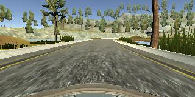
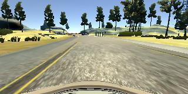
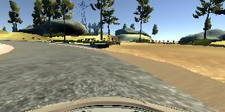

#**Behavioral Cloning** 

##Writeup Template

###You can use this file as a template for your writeup if you want to submit it as a markdown file, but feel free to use some other method and submit a pdf if you prefer.

---

**Behavioral Cloning Project**

The goals / steps of this project are the following:
* Use the simulator to collect data of good driving behavior
* Build, a convolution neural network in Keras that predicts steering angles from images
* Train and validate the model with a training and validation set
* Test that the model successfully drives around track one without leaving the road
* Summarize the results with a written report


[//]: # (Image References)

[image1]: ./examples/placeholder.png "Model Visualization"
[image2]: ./examples/placeholder.png "Grayscaling"
[image3]: ./examples/placeholder_small.png "Recovery Image"
[image4]: ./examples/placeholder_small.png "Recovery Image"
[image5]: ./examples/placeholder_small.png "Recovery Image"
[image6]: ./examples/placeholder_small.png "Normal Image"
[image7]: ./examples/placeholder_small.png "Flipped Image"

## Rubric Points
###Here I will consider the [rubric points](https://review.udacity.com/#!/rubrics/432/view) individually and describe how I addressed each point in my implementation.  

---
###Files Submitted & Code Quality

####1. Submission includes all required files and can be used to run the simulator in autonomous mode

My project includes the following files:

* model.py containing the script to create and train the model
* drive.py for driving the car in autonomous mode
* model.h5 containing a trained convolution neural network 
* writeup_report.md summarizing the results

####2. Submission includes functional code
Using the Udacity provided simulator and my drive.py file, the car can be driven autonomously around the track by executing 

```sh
python drive.py model.h5
```

####3. Submission code is usable and readable

The model.py file contains the code for training and saving the convolution neural network. The file shows the pipeline I used for training and validating the model, and it contains comments to explain how the code works.

###Model Architecture and Training Strategy

####1. An appropriate model architecture has been employed

My model consists of a convolution neural network with 5x5 and 3x3 filter sizes and depths between 26 and 54 (model.py lines 85-89) 

All the convolutional layers have the activation of 'relu' to introduce nonlinearity (code lines 85-89), and the data is normalized in the model using a Keras lambda layer (code line 84). I also added a cropping layer at the beginning in order to select only the region of interest.

####2. Attempts to reduce overfitting in the model

Because of the NVIDIA architecture does not contain any dropout layer I also did not add and the model performed well without any dropout layers. But I increased the number of samples by using 3 camera inputs and augmenting the data were also helpful for reducing overfitting.

The model was trained and validated on different data sets to ensure that the model was not overfitting (code line 14). The model was tested by running it through the simulator and ensuring that the vehicle could stay on the track.

####3. Model parameter tuning

The model used an adam optimizer, so the learning rate was not tuned manually (model.py line 96).

####4. Appropriate training data

Training data was chosen to keep the vehicle driving on the road. I used a combination of center lane driving, recovering from the left and right sides of the road and also clockwise driving mentioned in the lectures notes. 

For details about how I created the training data, see the next section. 

###Model Architecture and Training Strategy

####1. Solution Design Approach

The overall strategy for deriving a model architecture was to start with Lenet but could not succeeded to keep the track on the road. I have tried several approches using 3 camera inputs augmenting the data, driving clockwise etc.

My final step was to try a convolutional neural network model of NVIDIA and see the performance of that model. Surprisingly, I have managed a succesful driving just after fine tuning the correction factor a couple of times. The track were get out of the road only two times from the left sides at first. And I had already recognized that increasing the correction factor keeps the track more to the right side of the road from my previous trials on Lenet. So, I decided to increase it for my last architecture and see how does it drive.

So, my next step was to running the simulator with correction factor of higher values to see how well the car was driving around track one. Now there were a single spot where the vehicle fell off the track again but to improve the driving behavior in this case, I played on the correction factor again and finally achieved the fully succesful lap with the value of 0.32. The filename for this recording is : 

```
01run1-wo_augmented-wo_track2_data_track1.mp4
```

After achieving the succesful lap on track1 without augmenting the data and with just the data for track1 I decided to record track2 data and see how the model behaves. At that time the drivings for both tracks were failed. So, I decided to reduce the correction factor, because training the network for both track1 and track2 data disturbed the old succesful behaviour. So, I reduced the correction factor until the beginning value of 0.2 and the driving behaviour is better but again there were some spots where the vehicle fell off both of the tracks. 

So, I decided to augment the data finally and see the results. Bingo! Augmenting the data also increased the performance too and I almost achieved the succesful laps for both tracks. At that time the number of epochs were 5 and finally I increased the epochs from 5 to 10 and the results were perfect.

At the end of the process, the vehicle is able to drive autonomously around both of the tracks without leaving the road.
The video filename for the first track is:

```
02run2-with_augmented-with-track2_data_track1.mp4
```

and the filename for the second track is :

```
02run2-with_augmented-with-track2_data_track2.mp4
```

####2. Final Model Architecture

The final model architecture (model.py lines 18-24) consisted of a convolutional neural network with the following layers and layer sizes below. 

Here is a visualization of the architecture:


```
____________________________________________________________________________________________________
Layer (type)                     Output Shape          Param #     Connected to
====================================================================================================
cropping2d_1 (Cropping2D)        (None, 65, 320, 3)    0           cropping2d_input_1[0][0]
____________________________________________________________________________________________________
lambda_1 (Lambda)                (None, 65, 320, 3)    0           cropping2d_1[0][0]
____________________________________________________________________________________________________
convolution2d_1 (Convolution2D)  (None, 31, 158, 24)   1824        lambda_1[0][0]
____________________________________________________________________________________________________
convolution2d_2 (Convolution2D)  (None, 14, 77, 36)    21636       convolution2d_1[0][0]
____________________________________________________________________________________________________
convolution2d_3 (Convolution2D)  (None, 5, 37, 48)     43248       convolution2d_2[0][0]
____________________________________________________________________________________________________
convolution2d_4 (Convolution2D)  (None, 3, 35, 64)     27712       convolution2d_3[0][0]
____________________________________________________________________________________________________
convolution2d_5 (Convolution2D)  (None, 1, 33, 64)     36928       convolution2d_4[0][0]
____________________________________________________________________________________________________
flatten_1 (Flatten)              (None, 2112)          0           convolution2d_5[0][0]
____________________________________________________________________________________________________
dense_1 (Dense)                  (None, 100)           211300      flatten_1[0][0]
____________________________________________________________________________________________________
dense_2 (Dense)                  (None, 50)            5050        dense_1[0][0]
____________________________________________________________________________________________________
dense_3 (Dense)                  (None, 10)            510         dense_2[0][0]
____________________________________________________________________________________________________
dense_4 (Dense)                  (None, 1)             11          dense_3[0][0]
====================================================================================================
Total params: 348,219
Trainable params: 348,219
Non-trainable params: 0
____________________________________________________________________________________________________
```

####3. Creation of the Training Set & Training Process

First I should say that, I could not managed to drive using mouse and I also do not have any joystick. So, the only option was for me to drive using keyboard and I have done my best while recording on track1. But finally I asked for help from my son and thanks to him, he performed extremely good recordings with keyboard on track2. Without him I could never manage to record drivings for the track2 with my idiotic gaming performance -:).

To capture good driving behavior, I first recorded two laps on track one using center lane driving. Here is an example image of center lane driving:

 

I then recorded the vehicle recovering from the left side and right sides of the road back to center so that the vehicle would learn to recover when the vehicle tends to go the sides of the road. These images show what a recovery looks like starting from left and right :

 
 

I also recorded single lap for clockwise driving.
Then I repeated this process on track two in order to get more data points.

To augment the data set, I also flipped images and angles thinking that this would increase the performance of the model. But I habe done flipping in the generator so I don't have any flipped image saved on my disk. The flippig process in the generator is between the code lines of 59 and 64. 

After the collection process, I had 146352 number of data points. Actually the total number of image_set for 3 cameras were 24392 for both track 1 and track2. Using 3 camera images made it 24392*3 = 73176 and augmenting made it double. I then preprocessed this data by adding a cropping layer at the beginning. After crooping I added a lambda layer in order to normalize the images.

I finally randomly shuffled the data set in the generator and put 20% of the data into a validation set. Actually I splitted first and shuffled later.

I used this training data for training the model. The validation set helped determine if the model was over or under fitting. The ideal number of epochs was 10 as evidenced by decrese of the loss were continuing. I used an adam optimizer so that manually training the learning rate wasn't necessary.
